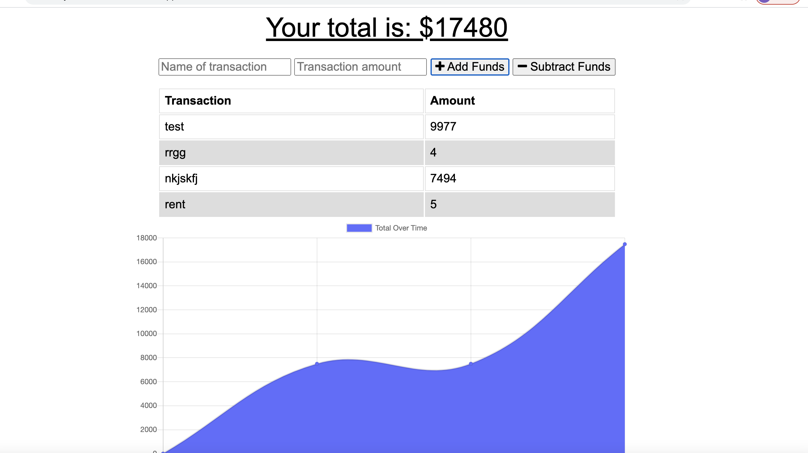

# how-do-dinosaurs-pay-bills-with-tryannosaurs-checks-
## Online Offline Budget Report 

## Links 
[GitHub_Repo](https://github.com/Chapstick24/how-do-dinosaurs-pay-bills-with-tryannosaurs-checks-)

[Herko](https://rocky-stream-69265.herokuapp.com/)

### function 

The Budget Tracker application allows for offline access and functionality for keeping track of a budget.

The user will be able to add expenses and deposits to their budget with or without an internet connection. When entering transactions offline, the total will populate when brought back online.

* Offline Functionality:

* Enter deposits offline;

* Enter expenses offline;

When brought back online:

* Offline entries are added to tracker.

## User Story 

AS AN avid traveller, I WANT to be able to track my withdrawals and deposits with or without a data/internet connection, SO THAT my account balance is accurate when I am traveling.

## Screen Shots

